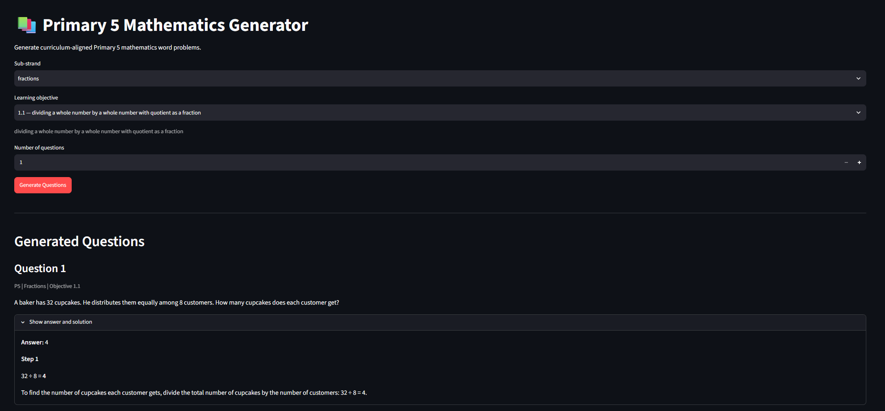
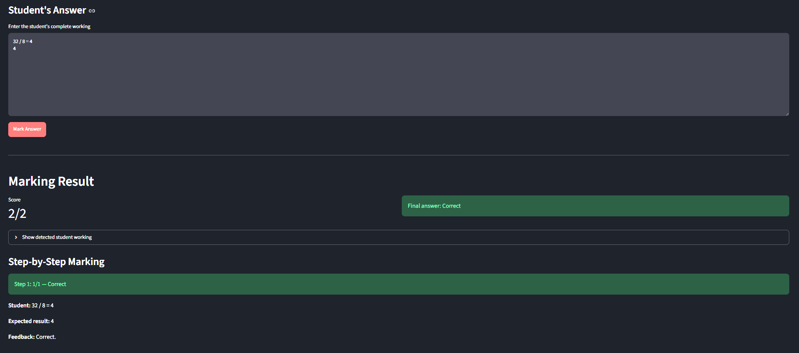

# P5 Mathematics Word Problem Question Generator & Marker

A mini AI-powered mathematics practice system for Singaporean Primary 5 students.

This project implements two capabilities:

- **Part A — Math Question Generator:** dynamically generates P5 word problems aligned to specific syllabus objectives, while using deterministic mathematical specifications and validation to prevent incorrect questions.

- **Part B — Auto-Marker:** accepts a student's complete free-form solution, extracts the student's working, evaluates mathematical correctness deterministically, awards step-level marks, and uses an LLM to produce student-friendly feedback.

The central design principle uses the LLM for language and interpretation, but does not rely on it as the source of mathematical truth.

---

## 1. Features

### Part A — Math Question Generator

The user can select:

- Level: P5
- Sub-strand / topic
- Specific syllabus objective
- Number of questions

The system generates word problems containing:

- Question text
- Final answer
- Step-by-step solution

The generator is designed around the Singaporean Primary 5 mathematics syllabus, including areas such as:

### Fractions

- Dividing a whole number by a whole number with a fractional quotient
- Expressing fractions as decimals
- Adding and subtracting mixed numbers
- Multiplying fractions and whole numbers
- Multiplying proper/improper fractions
- Multiplying mixed numbers and whole numbers

### Decimals

- Multiplying/dividing decimals by 10, 100 and 1000
- Converting between measurement units (implemented units are km, m, cm, kg, g, L, mL)

### Percentage

- Expressing a part of a whole as a percentage
- Using % notation (NOT IMPLEMENTED)
- Finding a percentage of a whole
- Discount, GST & Annual interest

### Rate

- Understanding rate as quantity per unit quantity
- Finding rate, total amount or number of units

---

# 2. Architecture

The system separates mathematical correctness from natural-language generation.

```text
                    PART A
                      │
                      ▼
            Mathematical Generator
                      │
                      ▼
            Authoritative Math Spec
                      │
                      ▼ 
            LLM Question Generation
                      │
                      ▼
            Deterministic validation
                      │
                      ▼
                    PART B
                      │
                      ▼
                Student answer
                      │
                      ▼
                LLM working parsing
                      │
                      ▼
                Auto-marker
                      │
         ┌────────────┴────────────┐
         ▼                         ▼
     Step-level marks             Final answer
         │                         │
         └────────────┬────────────┘
                      ▼
                Student feedback
```

---

# 3. Why this architecture?

A naive implementation might ask an LLM:

```text
Generate a Primary 5 question and solution.
```

or:

```text
Here is a student's answer.
Give them a mark.
```

This is unreliable because LLMs can make arithmetic errors and can inconsistently reason about equivalent mathematical representations.

Instead, the system assigns different responsibilities to different components.

### LLM responsibilities

Gemma 4 is used for:

- Turning a mathematical specification into natural language
- Parsing a student's free-form response
- Identifying working steps
- Identifying the final answer
- Generating natural-language feedback

### Deterministic Python responsibilities

Python is used for:

- Generating mathematical values
- Validating generated specifications
- Checking arithmetic
- Comparing fractions
- Comparing decimal/fraction/percentage equivalents
- Handling units
- Awarding marks

The LLM can make a language mistake, but it should not be allowed to decide whether `3/5 = 60%`.

---

# 4. Project Structure

```text
mwp-gen/
│
├── app.py
├── marker.py
├── generators.py
├── validator.py
├── syllabus.py
├── llm.py
├── models.py
│
├── requirements.txt
└── README.md
```

### `app.py`

Streamlit web application.

Contains:

- Question Generator UI
- Auto-Marker UI
- Ollama/Gemma calls for parsing and feedback
- Session state for generated questions

### `generators.py`

Generates the authoritative mathematical problem specifications.

The key idea is that the numerical problem is created before the LLM sees it.

### `syllabus.py`

Contains the Primary 5 syllabus structure and learning objectives to feed into both the UI and LLM prompt construction.

This prevents the generator from producing arbitrary "P5-looking" questions that are not tied to a defined curriculum objective.

### `validator.py`

Checks generated mathematical specifications before they are passed to the LLM.

### `llm.py`

Handles LLM-based question generation from an authoritative mathematical specification.

### `marker.py`

Contains the deterministic mathematical marking engine.

Responsibilities include:

- Parsing student answers
- Fraction equivalence
- Decimal equivalence
- Percentage equivalence
- Unit handling
- Step marking
- Final-answer marking

### `models.py`

Contains structured data models used by the generator and marker.

---

# 5. Part A — Question Generation

## 5.1 The problem with direct LLM generation

A direct approach might be:

```text
Prompt:
Create a P5 percentage question.

LLM:
A shirt costs $80 and has a 25% discount...
```

The problem is that the LLM has to simultaneously:

1. Select appropriate numbers
2. Construct a valid word problem
3. Perform the arithmetic
4. Generate the solution
5. Ensure the solution agrees with the question

Each additional responsibility creates another opportunity for an inconsistency.

For example:

```text
Question:
A shirt costs $80 and has a 25% discount.

LLM answer:
$65
```

The question is well-written, but mathematically wrong.

---

# 6. Authoritative Mathematical Specification

Instead, the generator first creates a structured mathematical specification.

Conceptually:

```python
{
    "sub_strand": "percentage",
    "syllabus_code": "1.3",
    "original_value": 80,
    "percentage": 25,
    "expected_answer": 20,
    "solution_steps": [
        {
            "step": 1,
            "expression": "25 / 100 × 80",
            "result": "20"
        }
    ]
}
```

The mathematical specification is the source of truth.

Gemma is then instructed to create a natural-language word problem that faithfully represents this specification.

---

# 7. Validation

Before the question is displayed, the generated mathematical specification is validated.

For example:

```text
25% of 80
= 25/100 × 80
= 20
```

The validator checks that the expected result is consistent with the mathematical inputs.

The natural-language LLM output is also validated against the specification where possible.

If validation fails, the question is discarded and another attempt is made.

Therefore:

```text
Generate
   ↓
Validate
   ↓
Valid? ── No ──> Regenerate
   │
  Yes
   ↓
Send to LLM
   ↓
Validate output
   ↓
Display
```

This is substantially safer than trusting the LLM's arithmetic.

---

# 8. Prompt Design for Part A

The LLM is given the authoritative mathematical specification and instructed to:

- Follow the supplied numbers
- Not change the answer
- Not introduce new mathematical conditions
- Produce age-appropriate language
- Produce a coherent word problem
- Produce explanations corresponding to the supplied solution steps

Conceptually:

```text
You are a Primary 5 mathematics question writer.

Create a word problem from this authoritative
mathematical specification.

Do not change any numbers.
Do not change the expected answer.
Do not introduce additional mathematical conditions.

Return:
1. Question
2. Explanation for each supplied solution step
```

The LLM is specifically used to generate the natural language framework for the specified numbers that were generated in python.

---

# 9. Part B — Auto-Marker

The Auto-Marker accepts a free-form student response.

For example:

```text
25% of 80 = 20
80 - 20 = 60
Answer: $60
```

The UI does not expose the expected number of steps.

The student simply submits their complete working.

---

# 10. Student Response Parsing

The LLM first converts the free-form response into a structured representation.

For example:

```json
{
    "steps": [
        {
            "step": 1,
            "text": "25% of 80 = 20"
        },
        {
            "step": 2,
            "text": "80 - 20 = 60"
        }
    ],
    "final_answer": "$60"
}
```

The LLM is not asked whether the answer is correct, only to interpret what the student wrote.

---

# 11. Deterministic Mathematical Marking

The structured student response is then passed to `marker.py`.

For example:

```text
Student:
25% of 80 = 20
80 - 20 = 60

Expected:
20
60
```

The marker compares the mathematical results.

It can treat representations such as:

```text
3/5
0.6
60%
6/10
six tenths
```

as equivalent where the parser supports those representations.

Internally, fractions can be represented using exact rational arithmetic rather than floating-point comparison.

For example:

```python
Fraction(3, 5)
```

is exactly equal to:

```python
Fraction(6, 10)
```

This avoids floating-point issues.

---

# 12. Units

The marker can also normalise common P5 measurement units.

Examples:

```text
1 kg = 1000 g
1 m = 100 cm
1 km = 1000 m
1 L = 1000 mL
```

Therefore, where appropriate:

```text
0.6 kg
600 g
```

can be interpreted as the same quantity.

The precise treatment of missing units can be configured according to the question's marking requirements.

---

# 13. Step-by-Step Marking

The marker can award marks independently for individual mathematical steps.

For example:

```text
Question:

A shop sells a bag for $80.
There is a 25% discount.
Find the sale price.
```

Student:

```text
25% of 80 = 30
80 - 30 = 50
Answer: $50
```

A useful marking result is:

```text
Step 1: 0/1
25% of 80 is not 30.

Step 2: 1/1
The subtraction is mathematically correct
given the student's previous value.

Final answer: 0/1
Correct answer: $60
```

This is more informative than simply returning:

```text
0/3
```

---

# 14. Error-Carried-Forward

An important consideration in mathematics marking is that a student can make one early error but then correctly apply their method afterwards.

For example:

```text
25% of 80 = 30
80 - 30 = 50
```

The first step is incorrect, but the second operation is internally consistent.

A production-quality marking system should distinguish:

```text
Conceptual/calculation error
```

from:

```text
Correct subsequent operation using an incorrect
previous result
```

The current implementation uses a conservative version of error-carried-forward logic.

This is an area that could be expanded for a production system because authentic exam marking rules can be considerably more nuanced.

---

# 15. Trade-offs

## Simplicity

The project lacks the following in the interest of time:

- A large database
- Authentication
- Distributed services
- Fine-tuning
- A complex frontend
- Production-scale observability

## Reliability

Additional complexity is introduced where reliability matters:

- Structured mathematical specifications (for mathematical correctness)
- Syllabus-controlled generation (generating syllabi aligned questions)
- Deterministic validation (ensuring mathematical correctness)
- Exact fraction arithmetic 
- Structured LLM output
- Separation between interpretation and marking

For the purpose of this project, we want to add complexity where an incorrect result is costly while keeping everything else as simple as possible.

---

# 16. Limitations

This is ultimately a prototype rather than a complete examination marking system, hence there may be bugs, especially in Part B where the LLM plays a larger role in the pipeline, despite the architecture attempting to reduce the impact of these errors by preventing the LLM from being the authoritative source of mathematical correctness.

---

# 17. How to run

## Requirements

Python 3.10+ is recommended.

Install dependencies:

```bash
pip install -r requirements.txt
```

Install and run Ollama separately.

Verify that the required Gemma model is available (For this repository, I use "gemma4:26b")

```bash
ollama list
```

Start the Streamlit application:

```bash
streamlit run app.py
```

The application will then be available through the local Streamlit URL, typically:

```text
http://localhost:8501
```

# 18. Things that could be improved

1) Modularise the LLM calls so that it is easier to swap out the LLM section of the architecture

2) Parameterise variables

3) Based on literature on this specific problem (https://arxiv.org/abs/2510.06965), the LLM used could be fine-tuned with datasets of roughly a few thousand annotated questions and answers in order to match the performance of larger LLMs. This would improve the speed of the application because inference speed is one of the biggest pain points from the current implementation.
